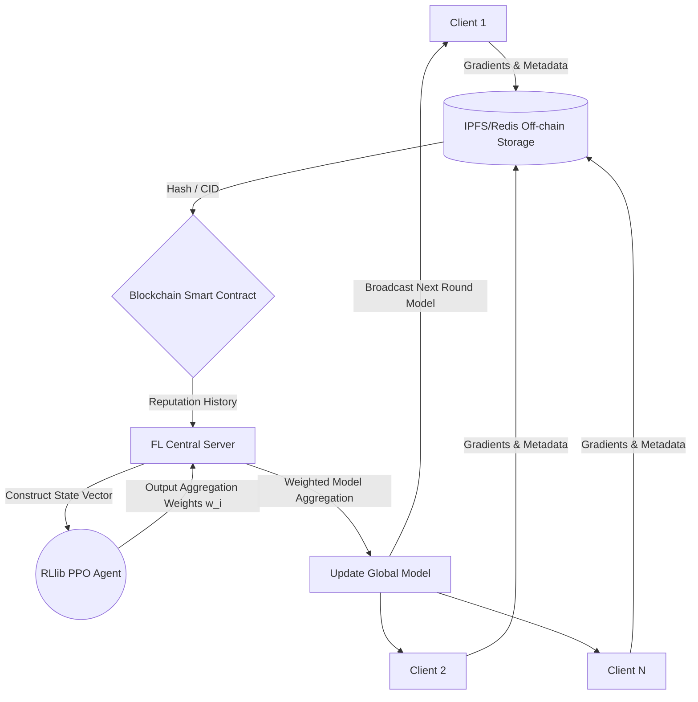

# Project Context: RL-based Reputation System for Robust FL over Blockchain

## 1. Project Overview
This repository contains a research project implementing a Reinforcement Learning-based Reputation System for Federated Learning (FL), secured by Blockchain technology. 

**Objective:** Use RL (PPO) to dynamically assign trust/reputation weights ($w_i \in [0,1]$) to FL clients to mitigate poisoning and Sybil attacks. Blockchain acts as an immutable ledger for reputation history, and off-chain storage (IPFS/Redis) holds the model gradients to save on gas costs.

## 2. Technical Stack
- **Federated Learning:** PyTorch, Flower (`flwr`)
- **Reinforcement Learning:** Ray RLlib (PPO/MAPPO), Gymnasium
- **Blockchain Layer:** Solidity (Smart Contracts), Hardhat/Foundry, `web3.py`
- **Storage Layer:** IPFS or Local Redis
- **Evaluation:** Matplotlib, FEMNIST / Shakespeare datasets

## 3. Threat Model
The system must be robust against 20-40% malicious nodes executing:
1.  **Label Flipping:** Swapping training labels locally.
2.  **Model Poisoning:** Injecting massive Gaussian noise into gradient updates.
3.  **Backdoors:** Injecting specific triggers into data.
4.  **Sybil Attacks:** Multiple fake clients submitting identical/coordinated updates.

## 4. System Architecture

---

# Multi-Terminal Development Strategy & Prompts

To prevent context mixing and ensure modular development, the codebase will be built across **4 separate terminals/processes** simultaneously. 

When you start working with Claude in your IDE or terminal, use the following prompts to kick off the actual code generation for each module.

### Terminal 1: Setting up the PyTorch/Flower Foundation (`src/fl_core/`)
**Goal:** Build the raw FL pipeline with malicious attackers and baselines (No RL, No Blockchain).

**Prompt to start development:**
> "I am setting up the foundational Federated Learning layer of my research project in `src/fl_core/`. We are using PyTorch and Flower (`flwr`) to train a CNN on the FEMNIST dataset across 100 clients. 
> 
> Please write three files for me:
> 1. `dataset.py`: Functions to load FEMNIST, partition it non-IID into 100 shards, and define the PyTorch CNN model.
> 2. `client.py`: A Flower client class. It needs a `malicious_type` flag. If it's a 'label_flipper', apply label shifting in the dataset. If it's a 'noise_injector', add Gaussian noise to the model weights in the `fit()` method before returning.
> 3. `server.py`: A basic Flower server setup running FedAvg for 10 rounds to test that the baseline network works and is successfully broken by the attackers."

### Terminal 2: Setting up the Blockchain & Storage Wrapper (`src/blockchain/`)
**Goal:** Build the Smart Contract and the Python wrappers to push gradients off-chain and commit IPs to Ethereum.

**Prompt to start development:**
> "I am building the immutable trust layer of my project in `src/blockchain/`. I need to store client reputations on-chain, but their massive PyTorch gradients off-chain using a local Redis instance (or IPFS).
>
> Please write three files for me:
> 1. `ReputationManager.sol`: A Hardhat Solidity contract mapping a client address to a struct containing `int reputationScore`, `string gradientHash`, and `metadata`. Only the server owner can update it.
> 2. `storage_utils.py`: A Python script that serializes a PyTorch model `state_dict` to bytes, stores it in a local Redis database (to simulate off-chain storage), and returns the unique hash key. It should also have a function to retrieve and deserialize it back to a tensor.
> 3. `blockchain_utils.py`: A `web3.py` script that connects to a local Hardhat node, deploys the contract, and provides functions like `update_client(address, score, hash)`."

### Terminal 3: Setting up the RL Agent (`src/rl_agent/`)
**Goal:** Define the Custom Gymnasium environment and the PPO training loop.

**Prompt to start development:**
> "I am building the Reinforcement Learning agent for my project in `src/rl_agent/`. We are using Ray RLlib (PPO) and Gymnasium. The agent acts as an FL aggregator learning to weight 100 clients based on their behavior.
>
> Please write two files for me:
> 1. `env.py`: Define a `FLReputationEnv(gym.Env)`. The observation space is a 100x5 array (features: accuracy_contribution, gradient_similarity, historical_reputation, loss_improvement, update_magnitude). The action space is a continuous vector of 100 values $w_i \in [0,1]$. Implement a `step()` function that calculates the reward $R = (0.5 * accuracy) - (0.3 * attack_impact) - (0.2 * instability)$. Include a helper method in `step()` to generate dummy observation data for testing.
> 2. `train_ppo.py`: A Ray RLlib script that initializes this custom environment and runs a PPO training loop for 50 iterations, saving the best checkpoint."

### Terminal 4: The Final Integration (`src/integration/`)
**Goal:** The custom Flower strategy that glues Terminals 1, 2, and 3 together.
*(Note: Only execute this prompt after the files from the other 3 terminals are written and tested).*

**Prompt to start development:**
> "I am tying together my 3 modules in `src/integration/`. I have a Flower FL setup (`src/fl_core/`), a blockchain/storage wrapper (`src/blockchain/`), and a trained RLlib PPO model (`src/rl_agent/`).
> 
> Please write the final `strategy.py` file:
> 1. Create a `RLReputationStrategy` inheriting from Flower's `Strategy` class.
> 2. Override `aggregate_fit()`. In this function:
>    - Download the client gradients (using `storage_utils.py`).
>    - Fetch client history from the blockchain (using `blockchain_utils.py`).
>    - Construct the 100x5 state matrix for the RL agent.
>    - Load my PPO checkpoint and run inference (`compute_single_action`) to get the 100 weight values $w_i$.
>    - Perform a weighted average of the gradients using PyTorch and these $w_i$ values.
>    - Calculate the reward, update the blockchain scores, and return the new global model."

<!-- SESSION_START -->
## Current Session
<!-- Auto-managed by session_init hook. Overwritten each session. -->
- Resume: `claude --resume 8e13cd15-68b2-4fc1-8204-096a25078e64`
- Team: `pact-8e13cd15`
- Started: 2026-03-18 04:23:37 UTC
<!-- SESSION_END -->
