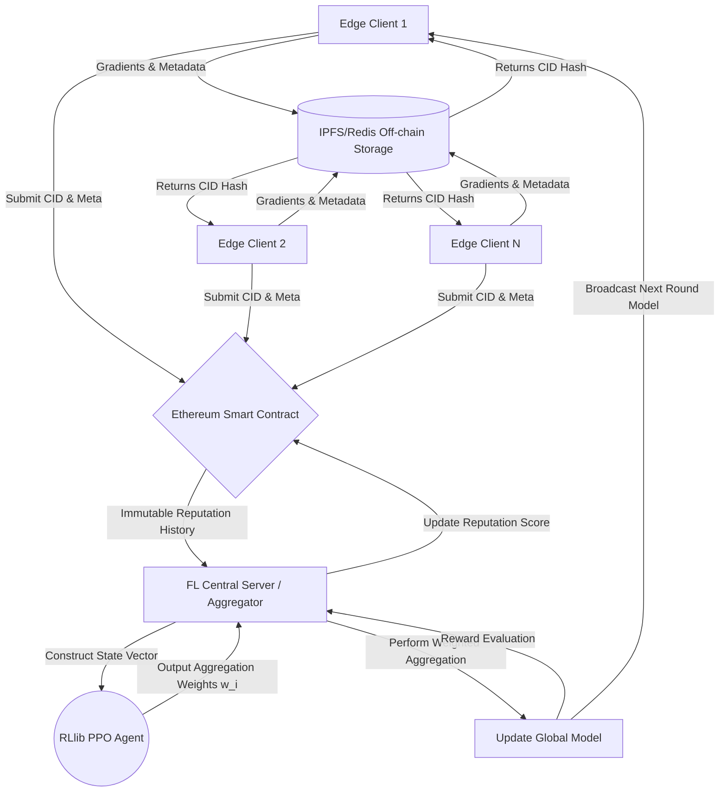

# R3-FL: Reinforcement Learning-based Reputation System for Robust Federated Learning over Blockchain

[](https://www.python.org/downloads/)
[](https://pytorch.org/)
[](https://flower.dev/)
[](https://ethereum.org/)
[](https://docs.ray.io/en/latest/rllib/index.html)

A novel research architecture bridging **Federated Learning (FL)**, **Deep Reinforcement Learning (DRL)**, and **Blockchain**. R3-FL uses Proximal Policy Optimization (PPO) to autonomously learn and assign dynamic trust/reputation scores to edge clients. To prevent spoofing and ensure an immutable history of behavior, reputation matrices and gradient hashes are committed to a Blockchain Smart Contract, while heavy neural weights are managed by off-chain storage. 

This repository aims to pioneer autonomous, secure distributed learning robust against systemic adversarial attacks without relying on static heuristics.

---

## 📖 Theoretical Foundations

Traditional Federated Learning approaches—even robust ones like Krum or Trimmed Mean—rely on static mathematical thresholds to filter out malignant gradients. Adversaries constantly evolve to bypass these static rules (e.g., synchronized Sybil attacks or subtle gradient noise).

**Our Hypothesis:** By using an AI Agent (PPO) working inside the central aggregator, the server can dynamically learn to identify adversarial patterns over time. 

### The Reward Function
The Agent observes the network and outputs continuous aggregation weights $w_i \in [0, 1]$. It receives a reward $R$ based on the success of the global model after aggregation:
$$R = \alpha \cdot (\text{Weighted Accuracy}) - \beta \cdot (\text{Malicious Impact}) - \gamma \cdot (\text{Entropy/Instability Penalty})$$

### The Agent's State Vector
To make these decisions, for $N$ clients, the agent observes an $N \times 5$ property matrix:
1. **Accuracy Contribution:** The marginal improvement the client provides on a validation set.
2. **Gradient Similarity:** Cosine similarity of the client's gradients relative to the global mean.
3. **Loss Improvement:** Reduction in objective function loss.
4. **Update Magnitude:** L2 Norm of the client gradients.
5. **Historical Reputation:** EMA of the client's score, fetched immutably from the blockchain.

---

## 🏗️ System Architecture

R3-FL separates the compute-heavy AI elements from the storage constraint limits of the blockchain logic.



### Attack Vectors Defended
The test bench simulates a network where 20-40% of the clients are malicious actors executing the following profiles:
*   **Label Flipping (Data Poisoning):** Shifting training labels locally to corrupt decision boundaries.
*   **Gaussian Noise Injection:** Multiplying parameter weights by massive noise constraints to destabilize convergence.
*   **Sybil Attacks:** Coordinating multiple fake identities to submit identical malicious payloads simultaneously.

---

## 🚀 Getting Started

### 1. Prerequisites
- **Python:** 3.10+
- **Node.js:** v18+ (For Hardhat/Contract compilation)
- **Local Redis Server:** For off-chain gradient storage (simulate IPFS).

### 2. Environment Setup
Clone the repository and install the framework dependencies:
```bash
git clone https://github.com/TheRadDani/R3-FL.git
cd R3-FL

# Install machine learning and networking dependencies
pip install -r requirements.txt
# Alternatively: pip install flwr torch torchvision ray[rllib] web3 redis matplotlib sphinx
```

### 3. Running the Blockchain Layer
We use a local Hardhat or Anvil node to simulate the Ethereum backend. 
```bash
cd src/blockchain
# Install local node tools if needed (npm install --save-dev hardhat)
npx hardhat node
```
*Leave this terminal running. It will listen on `http://127.0.0.1:8545`.*

In a new terminal, deploy the smart contract:
```bash
python scripts/deploy.py
```

### 4. Start Redis (Off-chain storage)
Start a standard local Redis instance to act as the off-chain IPFS analogue:
```bash
redis-server --port 6379 
```

### 5. Running the Simulation
Execute the custom Flower `Strategy` that binds the PyTorch pipeline, the Blockchain tracking, and the inferred RL weights together:
```bash
cd src/integration
python strategy.py  # Or run a designated runner script tying the FL Server to this strategy
```

---

## 📁 Repository Structure

The physical codebase is deliberately isolated during development to ensure modular clarity between distinct computing paradigms.

```text
R3-FL/
│
├── src/
│   ├── fl_core/          # Neural Networks (CNN/FEMNIST) and Flower Client/Server logic.
│   │
│   ├── blockchain/       # Solidity Smart Contracts and Web3.py execution wrappers.
│   │
│   ├── rl_agent/         # Gymnasium custom environments and Ray RLlib PPO trainer loops.
│   │
│   └── integration/      # The custom flwr.Strategy merging PyTorch, Blockchain, and RL actions.
│
├── docs/                 # Sphinx generated RST and HTML API documentations.
├── data/                 # Raw dataset caches (E.g., torchFEMNIST).
├── tests/                # Pytest unit tests for FL data partitions, agents, and storage logic.
└── scripts/              # Bash utilities for spawning distributed servers/clients.
```

---

## 📊 Documentation & Metrics
Complete API documentation covering every single Python module is generated via **Sphinx**.
*   **GitHub Pages:** Push to the `main` branch to automatically trigger the `.github/workflows/docs.yml` which deploys the parsed RST to web.
*   **Local Build:** Navigate to `docs/` and run `make html`. The files will be generated in `docs/_build/html/index.html`.

## 🔬 Scientific Impact
This project aims to bridge RL, FL, and Web3 to introduce learning-based trust models to decentralized edge computing. Traditional paradigms lack verifiability for node performance, making applications like multi-hospital healthcare learning or automated IoT vehicle swarms risky. Our contribution provides a pathway to self-regulating, tamper-proof network orchestration.
