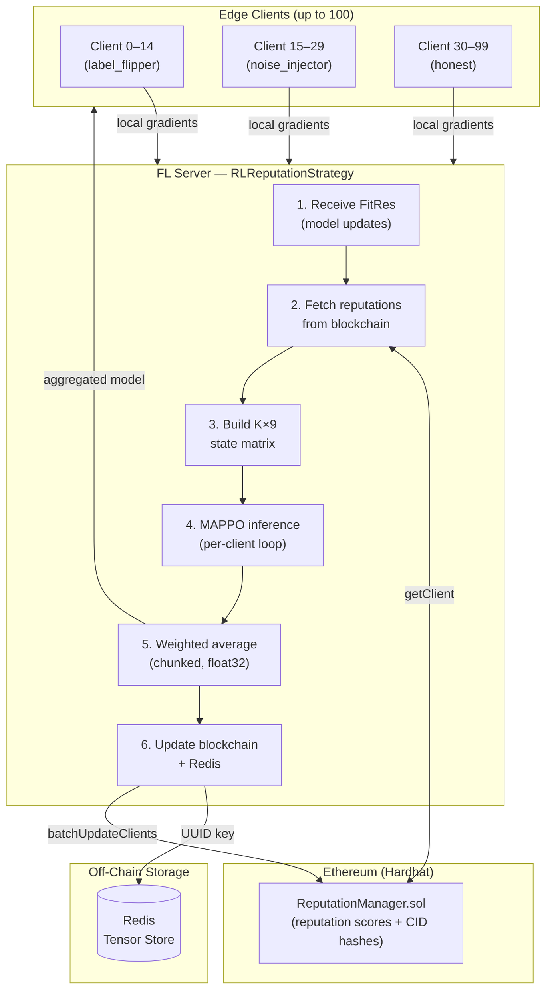

# R3-FL: Reinforcement Learning-based Reputation System for Robust Federated Learning over Blockchain

[](https://www.python.org/downloads/)
[](https://pytorch.org/)
[](https://flower.dev/)
[](https://docs.ray.io/en/latest/rllib/index.html)
[](https://ethereum.org/)
[](https://nodejs.org/)
[](#license)

> A research framework that uses a Multi-Agent PPO (MAPPO) reinforcement learning system with parameter sharing as a dynamic, self-learning trust arbiter inside a federated learning aggregation server, backed by an on-chain Ethereum reputation ledger.

---

## Overview

Traditional federated learning defenses against poisoning attacks — Krum, coordinate-wise Median, Trimmed Mean — rely on static mathematical rules. Adversaries learn to evade them. R3-FL replaces static rules with a trained Multi-Agent Proximal Policy Optimization (MAPPO) system with parameter sharing that observes per-client behavioral signals each round and outputs continuous aggregation weights. The agent learns over time which clients are trustworthy, adapting to adversarial strategies that static methods cannot detect.

The system consists of three tightly integrated layers:

1. **Federated Learning core** (Flower): A simulation of up to 100 clients training a CNN on FEMNIST. Clients may be honest, label-flipping, or noise-injecting. The server uses one of six pluggable aggregation strategies.

2. **Reinforcement Learning agent** (Ray RLlib / MAPPO): A custom Ray `MultiAgentEnv` environment (`FLReputationEnv`) models one FL aggregation round as a single RL step. Each FL client maps to one RL agent; all agents share a single policy network. The agent observes a (K×9) feature matrix (where K = number of participating clients) and each agent independently outputs a scalar aggregation weight. The system dynamically adapts to varying client cohort sizes without padding or retraining. It is trained offline, then loaded as a frozen policy at FL simulation time.

3. **Blockchain reputation ledger** (Ethereum / Hardhat): A Solidity smart contract (`ReputationManager`) stores every client's integer reputation score, gradient content-ID hash, and timestamp immutably on-chain. Redis stores the actual serialized model tensors off-chain; only the UUID key is committed on-chain to avoid gas costs for large payloads.

### Hypothesis

An AI agent running inside the aggregation server can learn to distinguish adversarial gradient updates from honest ones purely from behavioral signals, without prior knowledge of which clients are malicious — and can do so more robustly than static approaches as attacks evolve.

---

## Algorithm

### State Vector

At each communication round, each RL agent (one per participating client) receives an individual observation vector of shape `(9,)`:

| Feature index | Name | Scope | Description |
|---|---|---|---|
| 0 | `accuracy_contribution` | Local | Marginal improvement to the global model on a held-out validation set |
| 1 | `gradient_similarity` | Local | Cosine similarity of the client's flattened gradient vs. the mean gradient, rescaled to [0, 1] |
| 2 | `historical_reputation` | Local | Exponential moving average (α=0.3) of past reputation, fetched from the blockchain |
| 3 | `loss_improvement` | Local | Reduction in the global loss attributable to this client's update |
| 4 | `update_magnitude` | Local | L2 norm of the gradient update, min-max normalized across all clients |
| 5 | `global_mean_accuracy` | Global | Mean `accuracy_contribution` across all participating clients this round |
| 6 | `global_mean_similarity` | Global | Mean `gradient_similarity` across all participating clients this round |
| 7 | `global_mean_loss_improvement` | Global | Mean `loss_improvement` across all participating clients this round |
| 8 | `global_mean_magnitude` | Global | Mean `update_magnitude` across all participating clients this round |

The global context features (indices 5–8) give each agent a reference point against which to judge its own local features, providing the centralized context that stabilizes value-function learning while keeping the actor's input compact.

The state matrix is compactly represented as shape `(K, 9)` where K = number of participating clients (no padding). This eliminates the large centralized action space bottleneck and allows the system to dynamically adapt to varying client cohort sizes. All K agents observe their own row and share a single policy network.

### Reward Function

```
R = α · (weighted_accuracy) − β · (attack_impact) − λ · |weight_sum − 1|
```

Where:
- `weighted_accuracy` is the dot product of weights and per-client accuracy contributions, normalized by total weight.
- `attack_impact` is the fraction of total aggregation weight assigned to clients whose ground-truth identity is malicious.
- `|weight_sum − 1|` (coefficient λ=0.01) penalizes raw weight vectors whose sum deviates far from 1, resolving the scale ambiguity introduced by L1 normalization and encouraging the agent to discriminate rather than collapse all weights toward zero.
- Default: α=0.6, β=0.4.

### Aggregation Weights

In MAPPO with parameter sharing, each agent independently outputs a continuous scalar weight in [0, 1]. The K participating clients each produce one weight via the shared policy. These K weights are clipped to [0, 1] and L1-normalized to sum to 1 before weighted parameter averaging. This per-agent scalar output eliminates the large centralized action space bottleneck and scales naturally to any client cohort size.

### Aggregation Weight Pipeline

The inference process in `RLReputationStrategy` integrates multiple techniques to improve robustness:

1. **PPO Inference**: Each of the K participating clients produces a scalar weight via the shared policy.
2. **Heuristic Baseline** (safety net): Computes gradient similarity and magnitude-based weights as a fallback. During the first round (warmup), this baseline is used exclusively; in subsequent rounds it is blended with PPO.
3. **Blending** (Tier 1 fix): Final weights = `gamma * PPO_weights + (1 - gamma) * heuristic_weights`, where `gamma = 0.5` (equal influence after warmup). This ensures the trained policy is tempered by a robust, interpretable baseline.
4. **Cross-Round EMA Smoothing** (Tier 1 fix): Per-round weights are further smoothed via exponential moving average to prevent one adversarial round from cascading into model corruption. EMA formula: `final_weights = 0.5 * current_weights + 0.5 * previous_weights`.

### Reputation Update (EMA)

After each round, on-chain reputation scores are updated:
- Honest clients receiving high aggregation weight see their reputation increase.
- Malicious clients receiving high weight see their reputation decrease (because the signal becomes "agent trusted a bad actor").

EMA formula: `rep_new = (1 − 0.3) · rep_old + 0.3 · signal`

### Sequential Memory (LSTM State Persistence)

The trained PPO policy includes an LSTM cell. At inference time, the LSTM hidden state is:
- **Initialized** with zeros at the start of the FL simulation
- **Persisted** across consecutive FL rounds (Tier 1 fix) so the LSTM accumulates temporal patterns within a simulation
- **Carried forward** between rounds to enable detection of slow-drift poisoning and gradual attack escalation
- **Reset naturally** when a new `RLReputationStrategy` instance is created (one per benchmark run)

This allows the LSTM to encode behavioral trends over time — clients whose `update_magnitude` or `gradient_similarity` changes gradually become distinguishable from white-noise attacks on a per-round basis.

---

## Architecture



### Component Responsibilities

| Component | File | Responsibility |
|---|---|---|
| `FemnistCNN` | `src/fl_core/dataset.py` | 2-layer CNN, 62-class FEMNIST classifier; shared architecture across all clients and server |
| `FlowerClient` | `src/fl_core/client.py` | Honest or malicious Flower `NumPyClient`; executes local SGD with optional AMP and gradient checkpointing |
| `FedAvg server` | `src/fl_core/server.py` | Baseline Flower simulation: 100 clients, 30% malicious (15 label flippers + 15 noise injectors), 10 rounds |
| `FLReputationEnv` | `src/rl_agent/env.py` | Custom Ray `MultiAgentEnv`; one step = one FL round; per-agent (K,9) observations and scalar actions; dict-based API (obs_dict, action_dict, rewards_dict); all agents share reward |
| `train.py` | `src/rl_agent/train.py` | Ray RLlib MAPPO training loop with parameter sharing; saves checkpoints to `checkpoints/fl_reputation_ppo/` |
| `kernels.py` | `src/rl_agent/kernels.py` | Triton JIT kernel for reward normalization; graceful PyTorch fallback |
| `ReputationManager.sol` | `src/blockchain/contracts/` | Solidity contract: admin-gated write, open read, batch update, `ClientUpdated` events |
| `storage_utils.py` | `src/blockchain/storage_utils.py` | Redis upload/download for serialized tensors; zlib compression (level 1); UUID as CID key |
| `web3_utils.py` | `src/blockchain/web3_utils.py` | web3.py wrapper: deploy, `updateClient`, `batchUpdateClients`, `getClient` |
| `deploy.py` | `src/blockchain/scripts/deploy.py` | CLI script: deploys contract and writes `deployment.json` manifest |
| `RLReputationStrategy` | `src/integration/strategy.py` | Flower `Strategy` subclass that ties FL + blockchain + PPO together; includes heuristic blending, warmup, cross-round EMA smoothing, and LSTM state persistence across rounds |
| `run_benchmarks.py` | `scripts/run_benchmarks.py` | Runs multiple strategies head-to-head under identical attack conditions; outputs per-strategy JSON results |

### Attack Vectors Modeled

| Attack | Implementation | Behavior |
|---|---|---|
| **Label Flipping** | `LabelFlippedDataset` wrapper | Shifts all training labels by +1 mod 62 before local training |
| **Noise Injection** | `_inject_noise()` in `FlowerClient` | Adds Gaussian noise (std=10.0) to all model parameters after local training, before upload |
| **Sybil** | Multiple clients submitting identical coordinated updates | Tested by configuring large malicious fractions with identical attack types |

---

## Directory Structure

```
R3-FL/
├── src/
│   ├── fl_core/
│   │   ├── dataset.py          # EMNIST byclass loading, Dirichlet partitioning, FemnistCNN, PrefetchLoader
│   │   ├── client.py           # FlowerClient: honest / label_flipper / noise_injector
│   │   └── server.py           # Baseline FL simulation (FedAvg, 100 clients, 10 rounds)
│   │
│   ├── rl_agent/
│   │   ├── env.py              # FLReputationEnv: Ray MultiAgentEnv (K×9 obs per agent, scalar actions, shared policy)
│   │   ├── train.py            # MAPPO training loop via Ray RLlib; parameter sharing; CLI with --iterations, --num-workers
│   │   ├── kernels.py          # Triton reward-normalization kernel + PyTorch fallback + RunningMeanStd
│   │   └── __init__.py
│   │
│   ├── blockchain/
│   │   ├── contracts/
│   │   │   └── ReputationManager.sol  # Solidity 0.8.19: on-chain reputation registry
│   │   ├── scripts/
│   │   │   └── deploy.py       # Python CLI: compile + deploy + write deployment.json
│   │   ├── storage_utils.py    # Redis tensor upload/download with zlib compression
│   │   ├── web3_utils.py       # web3.py: deploy, updateClient, batchUpdateClients, getClient
│   │   ├── hardhat.config.ts   # Hardhat 3 configuration (Solidity 0.8.19, localhost network)
│   │   ├── package.json        # Node.js deps: hardhat, viem, ethers
│   │   └── README.md           # Hardhat project notes
│   │
│   └── integration/
│       └── strategy.py         # RLReputationStrategy: Flower Strategy integrating FL + blockchain + PPO
│
├── tests/
│   ├── conftest.py             # Shared pytest fixtures and configuration
│   ├── test_fl_core.py         # Dataset partitioning, CNN forward pass, malicious client behavior
│   ├── test_blockchain.py      # Redis round-trip, mocked web3 contract calls
│   ├── test_rl_agent.py        # MultiAgentEnv spaces, reward shape, MAPPO smoke test
│   └── test_integration.py     # End-to-end tests for RLReputationStrategy (93 tests)
│
├── docs/                       # Sphinx documentation source (RST + conf.py)
├── data/                       # Auto-downloaded EMNIST dataset cache (created on first run)
├── checkpoints/                # PPO training checkpoints (created by train.py)
├── results/                    # Benchmark JSON output (created by run_benchmarks.py)
├── scripts/
│   └── run_benchmarks.py       # Head-to-head strategy benchmark runner
├── deployment.json             # Written by deploy.py after contract deployment
├── pyproject.toml              # Package metadata (name=r3-fl, requires-python>=3.10)
├── requirements.txt            # Python dependencies
├── .github/workflows/
│   ├── docs.yml                # GitHub Actions: build and deploy Sphinx docs to GitHub Pages
│   └── tests.yml               # GitHub Actions: run pytest suite on push/PR with coverage reporting
```

---

## Prerequisites

| Dependency | Version | Purpose |
|---|---|---|
| Python | 3.10+ | Runtime |
| Node.js | 18+ | Hardhat / Solidity toolchain |
| Redis | 6+ | Off-chain gradient storage |
| CUDA (optional) | 11.8+ | GPU acceleration for training and simulation |

> **Hardware requirements for RL training:**
> The default worker count is `min(max(1, cpu_count - 2), 8)`. A machine with 8+ CPU cores and 16 GB RAM is sufficient for a minimal run.
>
> - **Multi-GPU server** (original target): All GPUs go to the learner; workers scale to CPU count. You can push `--num-workers` to 8 (the cap) if cores are available.
> - **Single-GPU workstation** (e.g., laptop with RTX 4090): The default configuration works without changes — the learner uses the GPU for policy updates and workers run entirely on CPU. Recommended: keep `--num-workers` at or below `cpu_count - 2`.
>
> If you see Ray warnings such as `"Insufficient GPUs"` or tasks stuck in `PENDING` waiting for GPU resources, a prior version of the config was assigning fractional GPUs to workers. Ensure you are running the current `train.py` (workers use `num_gpus_per_env_runner=0`) or pass `--num-workers 4` to reduce scheduling pressure.

---

## Getting Started

Follow these steps in order. You will need three terminals open by the end (Hardhat node, Redis, and your working shell).

### Step 1 — Clone and install Python dependencies

```bash
git clone https://github.com/TheRadDani/R3-FL.git
cd R3-FL

pip install -r requirements.txt

# Install as an editable package so `from src.*` imports resolve everywhere
pip install -e .
```

The `pip install -e .` step is required. Without it, `from src.fl_core.dataset import ...` style imports fail when running scripts from the project root.

### Step 2 — Install Node.js dependencies and compile contracts

```bash
cd src/blockchain
npm install          # first time only; installs Hardhat, viem, ethers
```

Compile the Solidity contract:

```bash
# Run this from src/blockchain/ where hardhat.config.ts lives
npx hardhat compile --force
```

> **Note on compile output**: After the first successful compilation, Hardhat caches the compiled artifacts. On subsequent runs, `npx hardhat compile` (without `--force`) will print:
> ```
> Nothing to compile
> ```
> or
> ```
> No contracts to compile
> ```
> **This is normal and expected Hardhat v3 behavior** — it means the contracts are already compiled and the cache is fresh. Only run `--force` when you want to recompile from scratch (e.g., after editing the Solidity source). For deployment you just need the artifacts to exist, which they will after any successful compile.

Return to the project root for all subsequent steps:

```bash
cd ../..
```

### Step 3 — Start the local Hardhat node

Open a dedicated terminal and leave it running throughout your session:

```bash
# Terminal A — keep this running
cd src/blockchain
npx hardhat node
```

The node prints 20 pre-funded test accounts and listens at `http://127.0.0.1:8545`. Account 0 (`0xf39Fd6e51aad88F6F4ce6aB8827279cffFb92266`) is used as the contract admin by default.

### Step 4 — Deploy the smart contract

With the Hardhat node running, deploy from the project root:

```bash
# Terminal B (or your main shell) — run from R3-FL/
python src/blockchain/scripts/deploy.py
```

Successful output:

```
[deploy] ReputationManager deployed at 0x5FbDB2315678afecb367f032d93F642f64180aa3
[deploy] Manifest written to: /path/to/R3-FL/deployment.json
```

`deployment.json` is written to the project root. It contains the contract address, ABI, deployer address, and block number. The `web3_utils.py` module reads the contract address from this file automatically.

If you see `ERROR: Hardhat artifact not found`, the compile step (Step 2) did not complete successfully — go back and run `npx hardhat compile --force`.

If you see `ERROR: Could not connect to Hardhat node`, the node from Step 3 is not running.

**Optional — override connection defaults with environment variables:**

```bash
export HARDHAT_RPC_URL="http://127.0.0.1:8545"   # default
export CONTRACT_ADDRESS="0x5FbDB2315678..."        # from deployment.json
export REDIS_HOST="localhost"                      # default
export REDIS_PORT="6379"                          # default
export REDIS_DB="0"                               # default
```

### Step 5 — Start Redis

Open another dedicated terminal:

```bash
# Terminal C — keep this running
redis-server --port 6379
```

Verify it is running:

```bash
redis-cli ping
# PONG
```

### Step 6 — Train the PPO agent

The RL agent must be trained before it can be used in the full FL simulation (`rl_reputation` strategy). The training runs entirely in the custom Gymnasium environment — no real FL simulation is needed at this stage.

```bash
python -m src.rl_agent.train
# or equivalently:
python src/rl_agent/train.py
```

**CLI flags:**

| Flag | Default | Description |
|---|---|---|
| `--iterations` | `50` | Number of PPO training iterations |
| `--num-workers` | auto | Parallel rollout workers (default: `min(max(1, cpu_count - 2), 8)`) |
| `--time-inference` | off | Wrap each iteration with CUDA synchronize timing to profile GPU bottlenecks |

> **Single-GPU note:** The script auto-detects your CPU count and sets `num_env_runners` accordingly. Rollout workers run on CPU; only the learner process uses the GPU. On machines with fewer cores you can cap workers explicitly:
> ```bash
> python -m src.rl_agent.train --num-workers 4
> ```
> If Ray prints warnings about insufficient GPU resources, you are likely running an older version of `train.py` that assigned fractional GPUs to workers. The current version sets `num_gpus_per_env_runner=0` for all workers, which resolves this.

**Examples:**

```bash
# Train for 200 iterations with explicit worker count
python -m src.rl_agent.train --iterations 200 --num-workers 8

# Train with CUDA timing diagnostics
python -m src.rl_agent.train --iterations 50 --time-inference
```

**Output:** Checkpoints are saved every 10 iterations to `checkpoints/fl_reputation_ppo/`. The final checkpoint is always saved regardless of interval.

**Training configuration (from `train.py`):**

| Parameter | Value | Notes |
|---|---|---|
| Algorithm | MAPPO | Multi-Agent PPO with parameter sharing |
| Framework | PyTorch | Explicit; required for AMP |
| Multi-Agent | Parameter sharing | Single policy network shared across all K agents |
| Per-agent obs space | (9,) | 9 features: 5 local (accuracy_contribution, gradient_similarity, historical_reputation, loss_improvement, update_magnitude) + 4 global means |
| Per-agent action space | (1,) | Scalar weight in [0, 1], clipped to [0, 1] and L1-normalized |
| Train batch size | 4000 steps | Reduce if GPU OOM |
| SGD minibatch | 256 | Balances gradient noise and throughput |
| SGD iterations | 10 per batch | |
| Learning rate | 5e-4 | Increased for faster initial convergence |
| Discount (γ) | 0.99 | |
| GAE (λ) | 0.95 | |
| Clip parameter | 0.2 | PPO clip |
| Entropy coefficient | 0.005 | Reduced exploration pressure with richer 9-dim observation |
| VF clip parameter | 50.0 | Prevents value-function updates being truncated under high reward variance |
| VF loss coefficient | 1.0 | |
| Gradient clip | 40.0 | |
| Network | [64, 64] FC | Sized for 9-feature per-agent inputs (not a large centralized input) |
| LSTM | enabled | `use_lstm=True`, `max_seq_len=20`; see Sequential Memory section below |
| Rollout fragment | 100 steps | Explicit; avoids the 250K RLlib observation-buffer warning |
| Batch mode | truncate_episodes | Releases fragments at 100-step boundaries for throughput |
| Evaluation interval | every 10 iterations | 5 episodes |

The script auto-detects GPU resources. On CUDA machines, all GPUs are allocated to the learner; rollout workers run on CPU only (`num_gpus_per_env_runner=0`) to avoid Ray demanding more GPU budget than a single-GPU machine can supply.

#### Sequential Memory (LSTM)

Setting `"use_lstm": True` in the RLlib model config wraps the `[64, 64]` fully-connected policy in an LSTM cell. Instead of treating each FL round as an independent observation, the LSTM threads a hidden state vector across consecutive rollout steps. Within each training sequence the agent therefore sees a window of `max_seq_len=20` consecutive FL rounds rather than a single snapshot.

**What `max_seq_len=20` means:** During training, RLlib unrolls the LSTM over sequences of 20 time steps drawn from the collected rollout. The LSTM's hidden state accumulates behavioral evidence across those 20 FL rounds before gradients are computed. This means a training example spans a 20-round window of the FL trajectory, not a single step.

**Why this helps:** Many adaptive poisoning strategies are invisible on any single round — a slow-drift attacker gradually inflates its `update_magnitude` over many rounds, staying below single-round detection thresholds. A Markovian policy (MLP without memory) cannot distinguish this from noise. The LSTM's hidden state encodes the trajectory of each agent's behavioral signals over time, making slow-drift poisoning, gradual reputation erosion, and oscillating attack strategies detectable patterns rather than noise.

**Inference implications:** At FL simulation time (`RLReputationStrategy`), the trained LSTM hidden state is **explicitly persisted across FL rounds** (Tier 1 fix, implemented in current version). The policy accumulates temporal context across rounds via `_lstm_state` that threads the LSTM hidden state between consecutive `compute_single_action` calls. This enables detection of slow-drift poisoning attacks that unfold gradually across many rounds rather than manifesting in a single snapshot.

**Architecture improvements (vs. baseline PPO):**

| Design choice | Previous | Current | Rationale |
|---|---|---|---|
| Observation features | 5 (local only) | 9 (5 local + 4 global means) | Solves partial observability: each agent sees how its local signals compare to the cohort average |
| Actor/critic sharing | Shared trunk | Separate networks | Prevents the faster-learning critic from destabilizing policy gradients via shared weights |
| Network width | [256, 256] | [64, 64] | Right-sized for the separated heads operating on 9-dim per-agent input; avoids over-parameterization |
| Sequential memory | None (MLP) | LSTM (`max_seq_len=20`) | Enables detection of slow-drift poisoning and temporal attack patterns invisible to Markovian policies |
| Learning rate | 3e-4 | 5e-4 | Speeds up initial learning with the richer 9-dim observation |
| Entropy coefficient | 0.01 | 0.005 | Less exploration pressure once the agent has good global context |
| VF clip parameter | 10.0 | 50.0 | Prevents value-function updates from being truncated when global reward variance is high |

### Step 7 — Run the baseline FL simulation

This runs FedAvg with 100 clients (15 label flippers + 15 noise injectors + 70 honest) for 10 communication rounds. No blockchain or RL agent is required.

```bash
python src/fl_core/server.py
```

The EMNIST byclass dataset (~500 MB) is downloaded automatically to `./data/` on first run.

**What happens:**

1. Loads and partitions EMNIST across 100 clients using a Dirichlet distribution (α=0.5).
2. Each round: samples 10% of clients for training, 5% for evaluation.
3. Aggregates with standard FedAvg (no Byzantine robustness).
4. Logs per-round centralized and distributed losses and accuracy.

### Step 8 — Run the full R3-FL simulation with blockchain and RL

Requires: Hardhat node running, contract deployed, Redis running, and a PPO checkpoint saved.

```bash
# Ensure PPO checkpoint exists
ls checkpoints/fl_reputation_ppo/

# Run the FL server using the RL-backed aggregation strategy
# (currently invoked from server.py by swapping the strategy;
#  or use run_benchmarks.py with --strategies rl_reputation)
python scripts/run_benchmarks.py --strategies rl_reputation --num-rounds 10
```

The `RLReputationStrategy` performs these steps each round:

1. Receives `FitRes` from all participating clients.
2. Maps each Flower CID to a deterministic Ethereum address.
3. Calls `getClient()` on `ReputationManager` to fetch historical reputation scores.
4. Computes cosine gradient similarity and L2 magnitude for each client.
5. Assembles the compact (K×9) state matrix where K = number of participating clients.
6. Performs per-client MAPPO inference: loops over K clients, calls `ppo_algo.compute_single_action(obs_i, policy_id="shared_policy")` for each agent, collects scalar weights.
7. Performs weighted average of model parameters (chunked, 10 clients per chunk, float32 accumulation).
8. Uploads the aggregated model to Redis; records the UUID key.
9. Calls `batchUpdateClients()` on the contract to commit all reputation scores atomically.

If the MAPPO checkpoint is unavailable or inference fails, the strategy falls back to uniform (FedAvg-style) weights and logs a warning. The per-client inference loop naturally adapts to any cohort size without padding or retraining.

#### Tier 1 Inference Improvements

The current implementation includes four targeted inference tuning changes:

1. **Heuristic Blending** (`_HEURISTIC_BLEND_GAMMA = 0.5`): Blend PPO and heuristic weights equally in steady state. The heuristic provides a robust, interpretable floor while PPO learns to improve on it.
2. **Warmup Strategy** (`warmup_rounds = 1`): During the first FL round, use pure heuristic weights (no PPO) because early-round features are unreliable (random model, low gradient signal-to-noise).
3. **Cross-Round EMA Smoothing** (`ema_alpha = 0.5`): Smooth aggregation weights across consecutive rounds to prevent single-round adversarial shocks from corrupting the aggregated model.
4. **LSTM State Persistence**: Thread the LSTM hidden state across rounds so the policy can detect temporal attack patterns (slow-drift, gradual escalation) instead of treating each round independently.

---

## Running Benchmarks

`scripts/run_benchmarks.py` is the primary evaluation tool. It runs one or more aggregation strategies under identical conditions and saves per-round metrics as JSON files.

### Prerequisites

Before launching the benchmark runner, verify the following are in place:

| Requirement | When required | How to check |
|---|---|---|
| Hardhat node running at `http://127.0.0.1:8545` | Always (all strategies use blockchain state) | `curl -s -X POST http://127.0.0.1:8545 -H 'Content-Type: application/json' -d '{"jsonrpc":"2.0","method":"eth_blockNumber","params":[],"id":1}'` |
| `deployment.json` exists in project root | Always | `ls deployment.json` |
| Redis running at `localhost:6379` | Always | `redis-cli ping` |
| PPO checkpoint at `checkpoints/fl_reputation_ppo/` | Only when running `rl_reputation` strategy | `ls checkpoints/fl_reputation_ppo/` |

If the Hardhat node is not running, start it first (`npx hardhat node` from `src/blockchain/`), then redeploy the contract (`python src/blockchain/scripts/deploy.py`). The contract address in `deployment.json` changes on every deployment — you must redeploy after restarting the node.

If no PPO checkpoint exists and you include `rl_reputation` in `--strategies`, the script will raise a `RuntimeError` and skip that strategy. Train first:

```bash
python -m src.rl_agent.train --iterations 50
```

### Usage

```bash
python scripts/run_benchmarks.py [OPTIONS]
```

### Options

| Flag | Default | Description |
|---|---|---|
| `--strategies` | `all` | Space-separated strategy names, or `all` to run every strategy |
| `--num-rounds` | `8` | Number of FL communication rounds per strategy |
| `--num-clients` | `20` | Total number of simulated clients |
| `--malicious-fraction` | `0.3` | Fraction of clients that are malicious (e.g., `0.3` = 30%) |
| `--attack-type` | `label_flip` | Attack type: `label_flip` or `noise_inject` |
| `--target-accuracy` | `0.7` | Accuracy threshold used to compute convergence round |
| `--output-dir` | `results` | Directory where JSON result files are written |
| `--seed` | `42` | Random seed for reproducibility (controls data partition and client assignment) |

Available strategy names: `fedavg`, `krum`, `median`, `trimmed_mean`, `fltrust`, `rl_reputation`

### Examples

```bash
# Compare FedAvg and Krum under label-flip attack, 20 rounds
python scripts/run_benchmarks.py \
    --strategies fedavg krum \
    --num-rounds 20 \
    --num-clients 20 \
    --malicious-fraction 0.3 \
    --attack-type label_flip

# Full comparison of all strategies under noise injection
python scripts/run_benchmarks.py \
    --strategies all \
    --num-rounds 50 \
    --num-clients 50 \
    --malicious-fraction 0.4 \
    --attack-type noise_inject \
    --output-dir results/noise_inject_50_clients

# Quick smoke test (single strategy, 3 rounds, fewer clients)
python scripts/run_benchmarks.py \
    --strategies median \
    --num-rounds 3 \
    --num-clients 10 \
    --malicious-fraction 0.2
```

### Output

Each strategy produces a JSON file in `--output-dir`:

```
results/
├── fedavg_metrics.json
├── krum_metrics.json
├── median_metrics.json
├── trimmed_mean_metrics.json
├── fltrust_metrics.json
└── rl_reputation_metrics.json
```

Each file has this structure:

```json
{
  "strategy": "krum",
  "attack_type": "label_flip",
  "malicious_fraction": 0.3,
  "num_clients": 20,
  "num_rounds": 5,
  "rounds": [0, 1, 2, 3, 4],
  "accuracy": [0.0, 0.12, 0.23, 0.31, 0.38],
  "loss": [4.12, 3.87, 3.54, 3.20, 2.98],
  "attack_success_rate": [0.0, 0.0, 0.0, 0.0, 0.0],
  "client_weights": [[0.0, 0.0, ..., 1.0, 0.0]],
  "convergence_round": null,
  "target_accuracy": 0.7
}
```

`convergence_round` is the first round where accuracy exceeds `--target-accuracy`, or `null` if never reached.

### Strategy Descriptions

| Strategy | Class | Description |
|---|---|---|
| `fedavg` | `flwr.server.strategy.FedAvg` | Standard weighted average. Baseline — fails under attack. |
| `krum` | `KrumStrategy` | Selects the single update with minimum sum of distances to its `n - f - 2` nearest neighbors. Requires known Byzantine count. |
| `median` | `MedianStrategy` | Coordinate-wise median across all client updates. No weight output. |
| `trimmed_mean` | `TrimmedMeanStrategy` | Removes the top and bottom `beta` (default 10%) fraction of values per coordinate before averaging. |
| `fltrust` | `FLTrustStrategy` | Server trains on a 1% clean trust dataset, computes ReLU(cosine similarity) as trust scores, rescales client updates by server-update norm. |
| `rl_reputation` | `RLReputationStrategy` | PPO agent derives weights from behavioral features + blockchain reputation history. |

### Prerequisites for `rl_reputation`

The `rl_reputation` strategy requires a trained PPO checkpoint. The script searches these paths in order:

1. `checkpoints/fl_reputation_ppo`
2. `checkpoints/ppo_latest`
3. `checkpoints/ppo`
4. `$PPO_CHECKPOINT_PATH` environment variable

If no checkpoint is found, the strategy raises `RuntimeError` and is skipped. See the Prerequisites table above for how to train the agent before running this strategy.

### Resource Management

The benchmark runner manages memory explicitly between strategy runs:

- Ray object store is capped at 2 GB (`object_store_memory`) to prevent default 30% RAM reservation.
- GPU VRAM is cleared with `torch.cuda.empty_cache()` between strategies.
- Python GC is called (`gc.collect()`) after each strategy to reclaim fragmented memory.
- Per-client GPU fraction is computed as `num_gpus / num_concurrent_clients` to prevent Ray resource exhaustion.

---

## Running Tests

```bash
# Run the full test suite
pytest tests/ -v

# Run individual test modules
pytest tests/test_fl_core.py -v
pytest tests/test_blockchain.py -v
pytest tests/test_rl_agent.py -v
pytest tests/test_integration.py -v

# Run tests with coverage report
pytest tests/ -v --cov=src --cov-report=html
```

Tests cover:
- `test_fl_core.py`: EMNIST loading, Dirichlet partitioning statistics, CNN forward pass, `LabelFlippedDataset` correctness, `FlowerClient` fit/evaluate API.
- `test_blockchain.py`: Redis round-trip serialization/deserialization, mocked `web3.py` contract calls for `updateClient` and `getClient`.
- `test_rl_agent.py`: MultiAgentEnv observation/action space dtypes and shapes, reward computation correctness, reputation EMA update, MAPPO training smoke test.
- `test_integration.py`: End-to-end RLReputationStrategy tests covering initialization, state matrix building, MAPPO inference with dynamic cohort sizes, blockchain interactions, and weighted aggregation (93 tests across 15 test classes).

**GitHub Actions CI**: The `.github/workflows/tests.yml` workflow automatically runs the full pytest suite on every push and pull request, with coverage reporting.

---

## Building API Documentation

Documentation is auto-generated from Python docstrings using Sphinx.

```bash
cd docs
make html
# Open docs/_build/html/index.html in your browser
```

Pushing to `main` triggers the GitHub Actions workflow at `.github/workflows/docs.yml`, which builds and deploys the documentation to GitHub Pages automatically.

---

## Smart Contract Reference

`ReputationManager.sol` (Solidity ^0.8.19) is deployed on the local Hardhat network.

### Data Model

```solidity
struct ClientRecord {
    int256  reputationScore;  // RL-assigned reputation; may be negative
    string  gradientCidHash;  // Redis UUID key for latest serialized gradient tensors
    uint256 loss;             // Loss-improvement metric (scaled by 1e18)
    uint256 magnitude;        // L2 norm of gradient update (scaled by 1e18)
    uint256 lastUpdated;      // block.timestamp of last write
}
```

### Functions

| Function | Access | Description |
|---|---|---|
| `updateClient(address, int256, string, uint256, uint256)` | admin only | Update a single client's full record |
| `batchUpdateClients(address[], int256[], string[], uint256[], uint256[])` | admin only | Atomically update multiple clients in one transaction |
| `getClient(address) → ClientRecord` | public view | Read a client's current record |
| `transferAdmin(address)` | admin only | Transfer the admin role to a new address |

### Events

| Event | Emitted when |
|---|---|
| `ClientUpdated(address indexed client, int256 score, string cidHash)` | Any write to a client record |
| `AdminTransferred(address indexed previousAdmin, address indexed newAdmin)` | Admin role transferred |

### Accessing from Python

The `web3_utils.py` module provides high-level wrappers:

```python
from src.blockchain.web3_utils import deploy_contract, update_client_score, get_client_score

# Deploy (only needed once per Hardhat session)
address = deploy_contract(account_index=0)

# Write
update_client_score(
    client_address="0xAbCd...",
    score=850,
    cid="some-uuid-from-redis",
    loss=0,
    magnitude=0,
)

# Read
record = get_client_score("0xAbCd...")
# {"reputationScore": 850, "gradientCidHash": "some-uuid...", ...}
```

The contract address is resolved in this priority order:
1. Explicit `contract_address` argument
2. Module-level singleton set by `deploy_contract()`
3. `CONTRACT_ADDRESS` environment variable
4. `address` field in `deployment.json` at the project root

---

## Environment Variables Reference

| Variable | Default | Description |
|---|---|---|
| `HARDHAT_RPC_URL` | `http://127.0.0.1:8545` | Ethereum JSON-RPC endpoint |
| `CONTRACT_ADDRESS` | *(none)* | Pre-deployed `ReputationManager` address (skips deployment) |
| `REDIS_HOST` | `localhost` | Redis server hostname |
| `REDIS_PORT` | `6379` | Redis server port |
| `REDIS_DB` | `0` | Redis logical database index |
| `PPO_CHECKPOINT_PATH` | *(none)* | Override checkpoint path for `rl_reputation` strategy in benchmarks |

---

## Evaluation Baselines

The system is evaluated against the following baselines over 5–300 communication rounds with 10–100 clients and 20–40% malicious clients.

| Strategy | Description |
|---|---|
| **FedAvg** | Standard weighted average — baseline, no attack resistance |
| **Krum** | Euclidean-distance nearest-neighbor selection |
| **Median** | Coordinate-wise median |
| **Trimmed Mean** | Top/bottom percentile removal before averaging |
| **FLTrust** | Server-side trust dataset + cosine similarity scoring (Cao et al.) |
| **R3-FL (Ours)** | PPO agent with blockchain-backed reputation history |

### Metrics Tracked

- Global model accuracy per round
- Attack success rate per round
- Convergence round (first round exceeding target accuracy)
- Client aggregation weights per round (final round stored in JSON)
- Blockchain gas cost (estimated from Hardhat node receipts)

---

## Performance Notes

The codebase includes several performance optimizations relevant to running many simulated clients concurrently:

**CUDA / GPU:**
- `FlowerClient` uses `torch.amp.GradScaler` for mixed-precision training on CUDA.
- `PrefetchLoader` overlaps CPU-to-GPU transfers with GPU compute via a dedicated CUDA stream.
- Optional gradient checkpointing (`use_gradient_checkpointing=True`) trades ~30% extra compute for significantly lower peak activation memory, useful with 50–100 concurrent clients.
- `RLReputationStrategy` monitors GPU memory utilization and logs a warning at 80% capacity.

**Memory:**
- `FLReputationEnv` pre-allocates all numpy buffers at construction time; no per-step allocations in the hot path.
- `RLReputationStrategy._weighted_average()` streams aggregation layer-by-layer and in client chunks of 10, bounding peak VRAM.
- Benchmark runner explicitly calls `gc.collect()` and `torch.cuda.empty_cache()` between strategy runs.

**Ray / Flower simulation:**
- Object store capped at 2 GB to prevent Ray from reserving 30% of RAM by default.
- Per-client GPU fraction is `num_gpus / num_concurrent_clients` to avoid Ray resource exhaustion.

---

## MAPPO Scalability Advantages

R3-FL's Multi-Agent PPO architecture with parameter sharing addresses critical scalability bottlenecks of centralized PPO:

### Problem: Single-Agent PPO Scaling Limits

The original single-agent PPO system used a large centralized action space (one weight per client) that:
- **Does not scale**: Fixed to exactly 100 clients; cannot adapt to different cohort sizes
- **High-dimensional bottleneck**: Large action space requires large networks and many gradient steps to learn effectively
- **Inefficient inference**: Padding non-participating clients creates wasted computation
- **Requires retraining**: Changing the number of clients necessitates retraining the policy

### Solution: Multi-Agent PPO with Parameter Sharing

MAPPO replaces this with K independent agents (one per participating client) that all share a single policy network:

| Aspect | Single-Agent PPO | MAPPO with Sharing |
|--------|------------------|-------------------|
| **Per-agent observation** | (NUM_CLIENTS, 9) padded matrix | (9,) per-agent features only |
| **Action dimensionality** | NUM_CLIENTS-dim vector | 1-dim scalar per agent |
| **Network size** | [256, 256] for large padded input | [64, 64] for 9-dim input |
| **Dynamic cohort sizes** | Fixed to NUM_CLIENTS | K∈[1, 100] without retraining |
| **Inference cost** | 1 call: O(NUM_CLIENTS) | K calls: O(K) with smaller per-call cost |
| **Participating-only training** | Padded with unused neurons | Only K agents backprop gradients |

### Practical Impact

- **Flexibility**: The same trained policy works for 10 clients, 50 clients, or 100 clients with zero retraining
- **Efficiency**: Smaller per-agent networks (9 features instead of padded NUM_CLIENTS-dim vectors) train faster and require less VRAM
- **Transparency**: Per-client inference loop makes per-client weights interpretable (no padding masks)
- **Scalability**: Parameter sharing bounds memory growth regardless of number of agents

---

## Scientific Context

R3-FL introduces learning-based trust models to federated learning systems that operate over verifiable decentralized infrastructure. Practical applications include:

- Multi-hospital federated learning, where participant trustworthiness cannot be assumed and gradient history must be auditable.
- IoT device swarms, where individual devices may be compromised and coordinated attacks (Sybil, noise injection) are operationally realistic.
- Any edge computing scenario where immutable, tamper-proof reputation history provides accountability guarantees that static aggregation rules cannot.

The key contribution is replacing a hand-tuned mathematical filter with a reward-shaped Multi-Agent RL policy (MAPPO with parameter sharing) that adapts its weighting strategy based on accumulated behavioral evidence — including cross-round memory encoded in on-chain reputation scores and, with LSTM, within-sequence temporal patterns. The multi-agent architecture with shared parameters enables the system to dynamically handle varying client cohort sizes without retraining, addressing a fundamental scalability constraint of centralized RL approaches.

---

## Citations and References

This project builds on foundational work in federated learning, reinforcement learning, and Byzantine-robust aggregation. Key references include:

### Federated Learning Frameworks
- **Flower (FLOWER)**: McMahan et al. "Flower: A Friendly Federated Learning Research Framework." arXiv preprint arXiv:2007.14861 (2020).
  - Provides the FL simulation framework and Strategy abstraction used in R3-FL.
  - Website: [https://flower.dev/](https://flower.dev/)

### Byzantine-Robust Aggregation Baselines
- **FedAvg**: McMahan et al. "Communication-Efficient Learning of Deep Networks from Decentralized Data." ICML 2017.
  - Standard federated averaging; used as baseline.

- **Krum**: Blanchard et al. "Machine Learning with Adversaries: Byzantine Tolerant Gradient Descent." NIPS 2017.
  - Euclidean distance-based robust aggregation; implemented as a baseline strategy.

- **Median / Trimmed Mean**: Yin et al. "Byzantine-Robust Distributed Learning: Towards Optimal Statistical Rates." ICML 2018.
  - Coordinate-wise statistical aggregation methods; implemented as baselines.

- **FLTrust**: Cao et al. "FLTrust: Byzantine-robust Federated Learning via Confidence-based Filtering." arXiv preprint arXiv:2012.01897 (2020).
  - Server-side trust dataset with cosine similarity scoring; implemented as a baseline strategy.

### Reinforcement Learning and Multi-Agent Learning
- **Proximal Policy Optimization (PPO)**: Schulman et al. "Proximal Policy Optimization Algorithms." arXiv preprint arXiv:1707.06347 (2017).
  - Core RL algorithm; implemented via Ray RLlib.

- **Multi-Agent PPO (MAPPO)**: Yu et al. "The Surprising Effectiveness of PPO in Cooperative Multi-Agent Games." arXiv preprint arXiv:2108.08040 (2021).
  - Multi-agent PPO with parameter sharing; used for R3-FL's distributed trust arbiter.
  - Website: [https://docs.ray.io/en/latest/rllib/index.html](https://docs.ray.io/en/latest/rllib/index.html)

### Reinforcement Learning Infrastructure
- **Ray RLlib**: Liang et al. "RLlib: Abstractions for Distributed Reinforcement Learning." ICML 2018.
  - Training framework for the PPO agent; provides scalable multi-agent environments and distributed learning.

- **Gymnasium**: Brockman et al. "OpenAI Gym." arXiv preprint arXiv:1606.01540 (2016).
  - Reinforcement learning environment specification; RLlib uses Gymnasium environment standard.

### Blockchain and Smart Contracts
- **Ethereum**: Wood et al. "Ethereum: A Secure Decentralised Generalised Transaction Ledger." (2014).
  - Blockchain platform for immutable reputation ledger; smart contracts written in Solidity 0.8.19.

- **Hardhat**: Nomic Foundation. "Hardhat: Ethereum Development Framework."
  - Local testing and development environment; used for contract testing and deployment.
  - Website: [https://hardhat.org/](https://hardhat.org/)

- **web3.py**: Pipermeister et al. "Web3.py: A Python library for interacting with Ethereum."
  - Python bindings for Ethereum JSON-RPC; used for contract interaction from `web3_utils.py`.

### Dataset and Benchmarks
- **EMNIST**: Cohen et al. "EMNIST: Extending MNIST to handwritten letters." IJCNN 2017.
  - Extended MNIST dataset; partitioned using Dirichlet distribution (α=0.5) for heterogeneous federated learning simulation.

### Attack Models
- **Label Flipping**: Nelson et al. "Poisoning Attacks against Support Vector Machines." ICML 2012.
  - Adversarial label corruption; simulated via `LabelFlippedDataset` wrapper.

- **Noise Injection**: Blanchard et al. "Machine Learning with Adversaries: Byzantine Tolerant Gradient Descent." NIPS 2017.
  - Gaussian noise injection into gradients; implemented in `FlowerClient._inject_noise()`.

- **Sybil Attacks**: Douceur et al. "The Sybil Attack." IPTPS 2002.
  - Multiple coordinated malicious clients; tested by configuring large malicious fractions with identical attacks.

### Temporal Learning and LSTM Memory
- **Long Short-Term Memory Networks (LSTM)**: Hochreiter & Schmidhuber. "Long Short-Term Memory." Neural Computation 1997.
  - Sequential memory architecture used in the trained PPO policy; enables detection of slow-drift poisoning.

- **Temporal Reasoning in RL**: Mnih et al. "Asynchronous Methods for Deep Reinforcement Learning." ICML 2016.
  - Foundation for LSTM-based policy learning in multi-step sequential environments.

---

## License

This project is for academic and research purposes.
