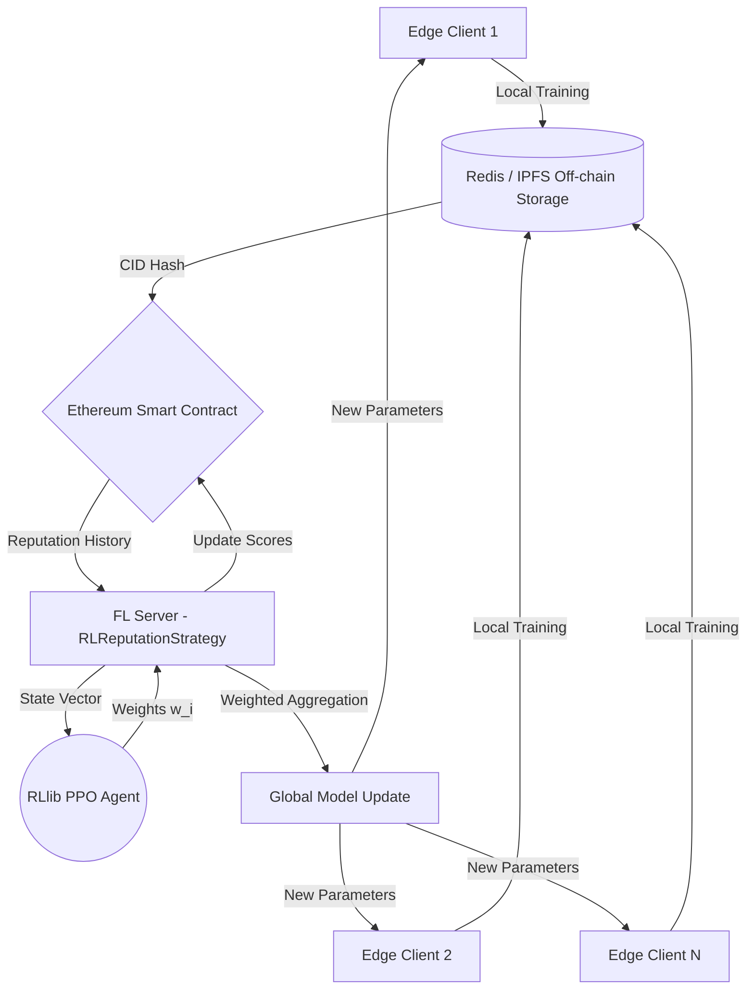

# R3-FL: Reinforcement Learning-based Reputation System for Robust Federated Learning over Blockchain

[](https://www.python.org/downloads/)
[](https://pytorch.org/)
[](https://flower.dev/)
[](https://ethereum.org/)
[](https://docs.ray.io/en/latest/rllib/index.html)

A novel research architecture bridging **Federated Learning (FL)**, **Deep Reinforcement Learning (DRL)**, and **Blockchain**. R3-FL uses Proximal Policy Optimization (PPO) to autonomously learn and assign dynamic trust/reputation scores to edge clients, while leveraging Blockchain as an immutable reputation ledger and off-chain storage (Redis/IPFS) for model gradients.

---

## 📖 Theoretical Foundations

Traditional FL approaches—even robust ones like Krum or Trimmed Mean—rely on static mathematical thresholds to filter out malicious gradients. Adversaries constantly evolve to bypass these static rules (e.g., synchronized Sybil attacks or subtle gradient noise).

**Our Hypothesis:** By using an AI Agent (PPO) working inside the central aggregator, the server can dynamically learn to identify adversarial patterns over time.

### The Reward Function
The Agent observes the network and outputs continuous aggregation weights $w_i \in [0, 1]$. It receives a reward $R$ based on the success of the global model after aggregation:

$$R = \alpha \cdot (\text{Weighted Accuracy}) - \beta \cdot (\text{Malicious Impact}) - \gamma \cdot (\text{Entropy/Instability Penalty})$$

### The Agent's State Vector
For $N$ clients, the agent observes an $N \times 5$ property matrix:

| Feature | Description |
|---|---|
| **Accuracy Contribution** | The marginal improvement the client provides on a validation set |
| **Gradient Similarity** | Cosine similarity of the client's gradients relative to the global mean |
| **Historical Reputation** | EMA of the client's score, fetched immutably from the blockchain |
| **Loss Improvement** | Reduction in objective function loss |
| **Update Magnitude** | L2 Norm of the client gradient update |

---

## 🏗️ System Architecture



### Attack Vectors Defended
The system is tested against 20–40% malicious clients executing:
- **Label Flipping (Data Poisoning):** Shifts training labels locally by +1 (mod num_classes).
- **Gaussian Noise Injection:** Adds massive noise (std=10.0) to model parameter weights before uploading.
- **Sybil Attacks:** Multiple fake clients submitting identical coordinated malicious updates.

---

## 📁 Project Structure

```text
R3-FL/
├── src/
│   ├── fl_core/                    # Federated Learning core
│   │   ├── dataset.py              # FEMNIST (EMNIST byclass) loading, non-IID Dirichlet partitioning, CNN model
│   │   ├── client.py               # Flower NumPyClient with malicious behaviors (label_flipper, noise_injector)
│   │   └── server.py               # Flower server with FedAvg and robust baselines (Krum, Median, TrimmedMean)
│   │
│   ├── blockchain/                 # Blockchain & off-chain storage layer
│   │   ├── contracts/
│   │   │   └── ReputationManager.sol  # Solidity smart contract for on-chain reputation tracking
│   │   ├── scripts/
│   │   │   └── deploy.py           # Python script to compile and deploy the contract via web3.py
│   │   ├── storage_utils.py        # Redis-based off-chain gradient storage (serialize/deserialize PyTorch tensors)
│   │   ├── web3_utils.py           # web3.py wrapper for reading/writing reputation scores on-chain
│   │   ├── hardhat.config.ts       # Hardhat configuration for the local Ethereum node
│   │   └── package.json            # Node.js dependencies for Hardhat/Solidity tooling
│   │
│   ├── rl_agent/                   # Reinforcement Learning agent
│   │   ├── env.py                  # Custom Gymnasium environment (FLReputationEnv) with 100x5 state matrix
│   │   └── train.py                # Ray RLlib PPO training loop with checkpoint saving
│   │
│   └── integration/                # System integration
│       └── strategy.py             # RLReputationStrategy: custom Flower Strategy combining FL + Blockchain + RL
│
├── tests/                          # Pytest test suite
│   ├── test_fl_core.py             # Tests for dataset partitioning, CNN model, and malicious client behavior
│   ├── test_blockchain.py          # Tests for Redis storage and mocked web3 contract interactions
│   └── test_rl_agent.py            # Tests for Gymnasium env spaces, reward computation, and PPO training
│
├── docs/                           # Sphinx documentation source (RST + conf.py)
├── data/                           # Auto-downloaded dataset cache (FEMNIST/EMNIST)
├── scripts/                        # Utility scripts
├── .github/workflows/docs.yml      # GitHub Actions: auto-build & deploy Sphinx docs to GitHub Pages
├── pyproject.toml                  # Python package config (enables `pip install -e .`)
└── requirements.txt                # Python dependencies
```

---

## 🚀 Getting Started

### Prerequisites
- **Python** 3.10+
- **Node.js** v18+ (for Hardhat / Solidity compilation)
- **Redis Server** (for off-chain gradient storage)

### 1. Clone & Install

```bash
git clone https://github.com/TheRadDani/R3-FL.git
cd R3-FL

# Install Python dependencies
pip install -r requirements.txt

# Install the project as an editable package (required for `from src.*` imports)
pip install -e .
```

### 2. Start the Blockchain Layer

**Terminal 1 — Start the local Ethereum node:**
```bash
cd src/blockchain
npm install            # Install Hardhat and Solidity dependencies (first time only)
npx hardhat node       # Starts a local Ethereum node on http://127.0.0.1:8545
```

**Terminal 2 — Deploy the Smart Contract:**
```bash
cd src/blockchain/scripts
python deploy.py       # Compiles and deploys ReputationManager.sol, outputs deployment.json
```

### 3. Start Redis (Off-chain Storage)

**Terminal 3:**
```bash
redis-server --port 6379
```

### 4. Train the RL Agent

**Terminal 4 — Train the PPO model:**
```bash
python src/rl_agent/train.py
```
This will train the PPO agent for 50 iterations on the custom `FLReputationEnv` Gymnasium environment and save checkpoints locally.

### 5. Run the Federated Learning Simulation

**Terminal 5 — Run the FL server with the RL-based strategy:**
```bash
python src/fl_core/server.py
```
The server uses the `RLReputationStrategy` (from `src/integration/strategy.py`) which:
1. Receives client model updates via Flower.
2. Fetches reputation history from the Blockchain.
3. Constructs the 100×5 state matrix.
4. Runs PPO inference to assign per-client aggregation weights.
5. Performs weighted model averaging.
6. Updates on-chain reputation scores.

---

## 🧪 Running Tests

```bash
# Run all tests
pytest tests/ -v

# Run tests for a specific module
pytest tests/test_fl_core.py -v
pytest tests/test_blockchain.py -v
pytest tests/test_rl_agent.py -v
```

---

## 📊 Building Documentation

API documentation is auto-generated from Python docstrings using **Sphinx**.

```bash
# Local build
cd docs
make html
# Open docs/_build/html/index.html in your browser

# Or push to main to trigger automatic GitHub Pages deployment via .github/workflows/docs.yml
```

---

## 📐 Evaluation & Baselines

The system is evaluated against the following baselines over 100–300 communication rounds with 50–100 clients (20–40% malicious):

| Strategy | Description |
|---|---|
| **FedAvg** | Standard weighted average (baseline — fails under attack) |
| **Krum** | Selects the single update closest to most others |
| **Median** | Coordinate-wise median of all updates |
| **Trimmed Mean** | Removes top/bottom percentiles before averaging |
| **FLTrust** | Server uses a trusted root dataset to bootstrap trust scores |
| **R3-FL (Ours)** | PPO agent dynamically learns to weight clients based on behavior |

### Metrics Tracked
- Global Model Accuracy
- Attack Success Rate
- Convergence Speed (rounds to target accuracy)
- Reputation Stability (variance of honest vs. malicious scores over time)
- Blockchain Gas Cost (estimated transaction overhead)

---

## 🔬 Scientific Impact

This project bridges RL, FL, and Web3 to introduce **learning-based trust models** to decentralized edge computing. Traditional paradigms lack verifiability for node performance, making applications like multi-hospital healthcare learning or automated IoT vehicle swarms risky. Our contribution provides a pathway to self-regulating, tamper-proof network orchestration.

---

## 📄 License

This project is for academic and research purposes.
